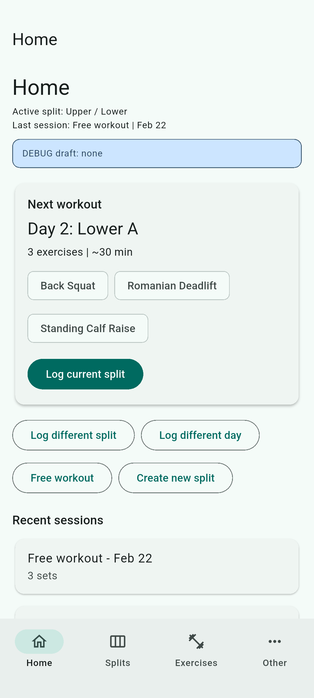
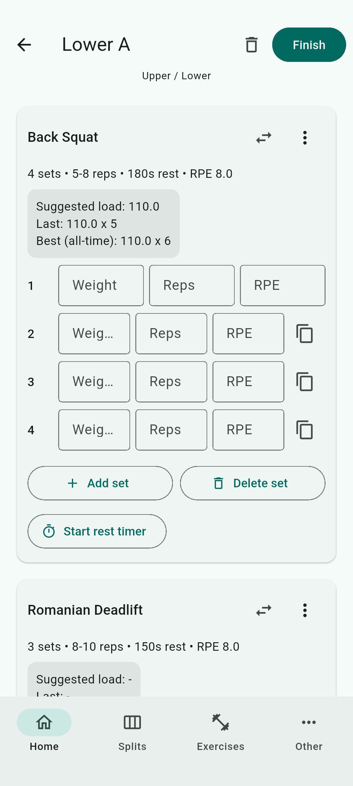
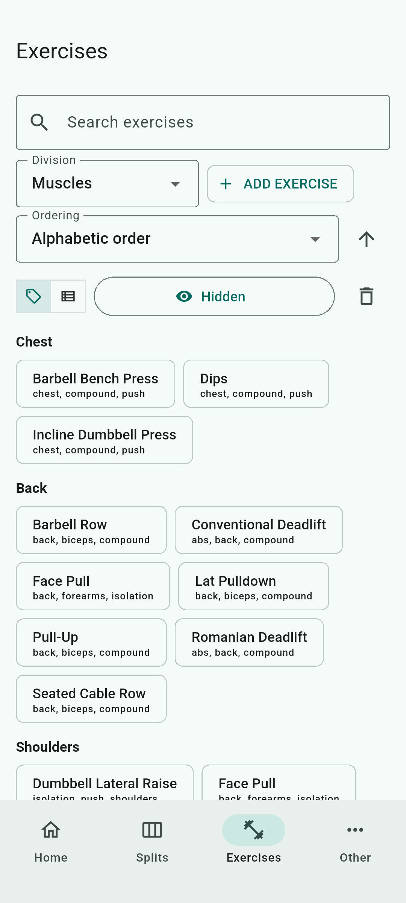
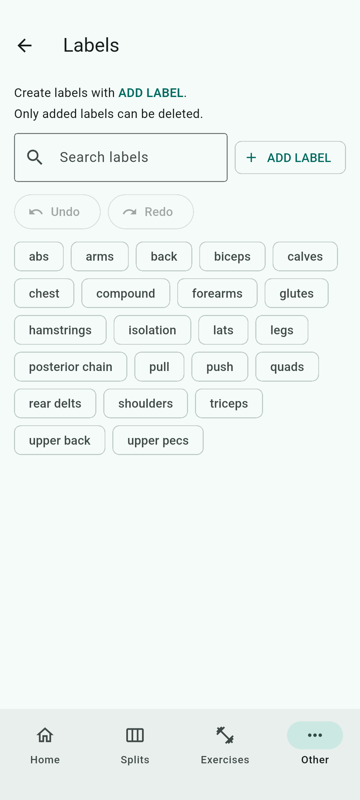

# Training Log App

Flutter training log app with split-day logging, free workout logging, and deterministic screenshot automation.

## Quick Start
0. You need to have flutter and an android emulator
installed (I use Android Studio)
1. Clone repository:
   - `git clone https://github.com/darioberretti01-droid/training_log.git`
   - `cd training_log`
2. Open app folder:
   - `cd app`
3. Install deps:
   - `flutter pub get`
4. Run checks:
   - `flutter analyze`
   - `flutter test`
5. Run app on Android emulator:
   - `flutter run -d emulator-5554`

## Current Product Scope
- Home v2 "Next workout" card (sequence-based suggestion logic).
- Recovery states when active split and last-used split differ.
- Split-day logger and free-workout logger in one screen.
- Draft persistence for in-progress workout logging.
- Session overview screen (view/edit/delete from Home recent sessions).
- Exercise catalog with grouping/filtering and label management.
- Split builder/detail flow with muscle-volume summary.

## Daily App Commands (Windows PowerShell)
From repository root:

```powershell
scripts\windows\dev_app.ps1 start
scripts\windows\dev_app.ps1 restart
scripts\windows\dev_app.ps1 stop
scripts\windows\dev_app.ps1 status
scripts\windows\dev_app.ps1 logs
```

Behavior defaults:
- Auto-launches `Medium_Phone_API_36.1` if no Android device is online.
- Runs in background and writes logs to `.devrunner/dev_app_latest.log`.
- Uses fast restart path by default.

Useful flags:
- Fresh deploy when needed: `scripts\windows\dev_app.ps1 restart -Fresh`
- Foreground run: `scripts\windows\dev_app.ps1 start -Foreground`
- Skip dependency refresh: `scripts\windows\dev_app.ps1 start -NoPubGet`

Convenience wrappers:
- `scripts\windows\start_app.ps1`
- `scripts\windows\restart_app.ps1`
- `scripts\windows\stop_app.ps1`
- `scripts\windows\app_status.ps1`

## UI Previews (GitHub)
Yes, GitHub renders images from relative repo paths.  
These previews are stored in `app/screenshots/current/`.

| Home | Logger |
| --- | --- |
|  |  |
|  |  |

Full catalog: `docs/05_screenshots.md`

## Repository Structure
- `app/` Flutter app source
- `docs/` roadmap, architecture, changelog, screenshot index
- `scripts/windows/` setup and screenshot helper scripts
- `.github/workflows/` CI workflows
- `AGENT.md` contributor guardrails

## Docs Map
- `docs/01_environment_setup.md` - Windows setup walkthrough
- `docs/02_long_term_plan.md` - roadmap and phase tracking
- `docs/03_codebase_guide.md` - architecture, data model, key flows
- `docs/04_change_log.md` - implementation notes by commit
- `docs/05_screenshots.md` - auto-generated screenshot index

## Screenshot Automation + Demo Fixtures
From repository root (PowerShell):

```powershell
scripts\windows\seed_demo_data.ps1
scripts\windows\run_screenshots.ps1
```

What this does:
- Resets local DBs and seeds deterministic demo data.
- Captures the integration screenshot catalog on `emulator-5554`.
- Writes PNGs to `app/screenshots/current/`.
- Validates manifest vs files and regenerates `docs/05_screenshots.md`.

Developer-only controls in app:
- `Other` tab -> `Debug tools`:
  - `Reset + seed demo data`
  - `Reset all data`