# 05 - Screenshots

Auto-generated from `app/integration_test/screenshots_manifest.dart`.

| Order | ID | Title | Scenario | Group | Preview |
| --- | --- | --- | --- | --- | --- |
| 1 | `home_next_workout` | Home - next workout | `baseRealistic` | `home` |  |
| 2 | `home_keep_logging_today` | Home - keep logging today | `homeKeepLoggingToday` | `home` | 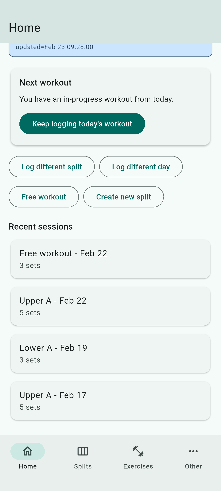 |
| 3 | `home_set_current_split` | Home - set current split | `homeNoCurrentSplit` | `home` | 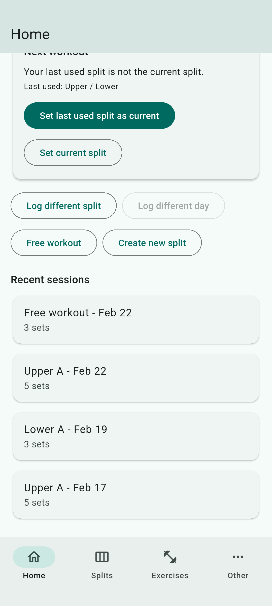 |
| 4 | `home_recovery_last_used_exists` | Home - recovery when last used split exists | `homeLastUsedExistsNotCurrent` | `home` | 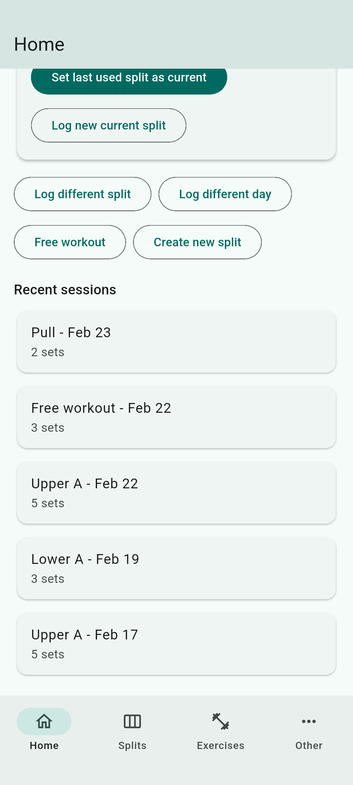 |
| 5 | `home_recovery_last_used_deleted` | Home - recovery when last used split deleted | `homeLastUsedDeleted` | `home` | 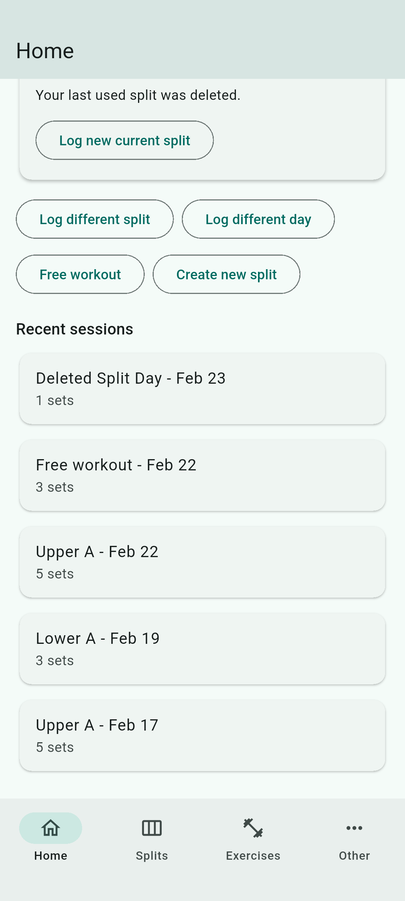 |
| 6 | `home_recent_sessions_populated` | Home - recent sessions populated | `baseRealistic` | `home` | 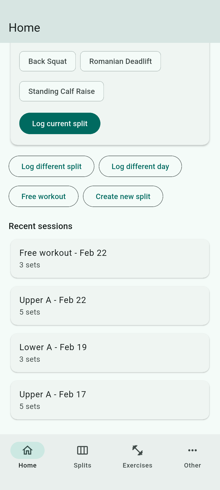 |
| 7 | `home_recent_sessions_empty` | Home - recent sessions empty | `homeNoSessions` | `home` | 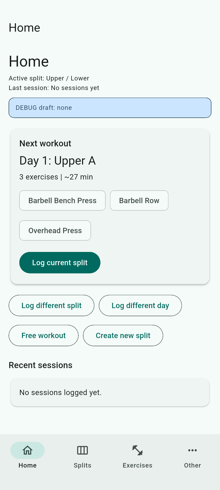 |
| 8 | `splits_list` | Splits - list | `baseRealistic` | `splits` | 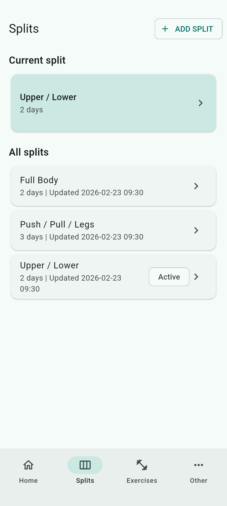 |
| 9 | `split_detail` | Splits - detail | `baseRealistic` | `splits` | 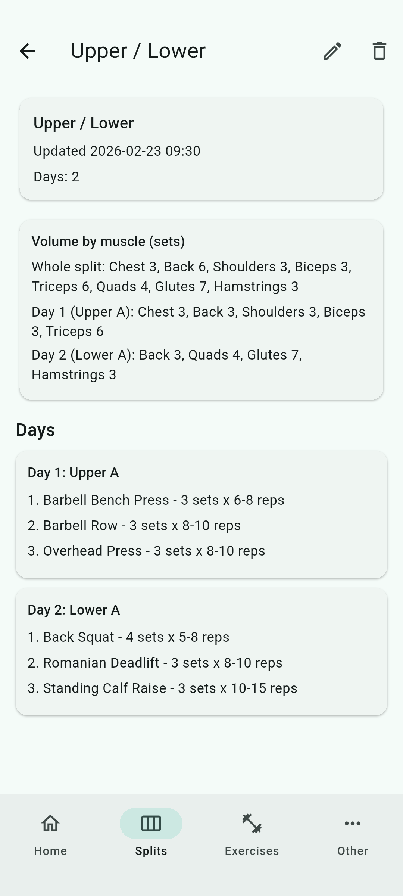 |
| 10 | `split_builder` | Splits - builder | `baseRealistic` | `splits` | 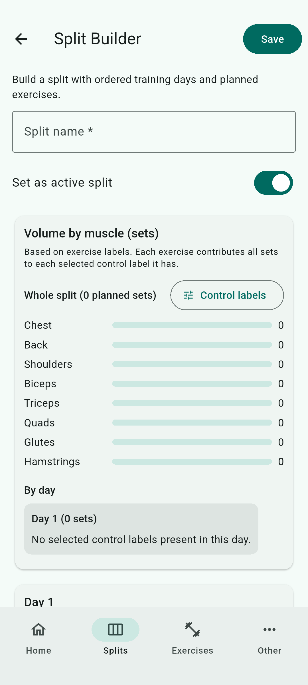 |
| 11 | `exercises_list` | Exercises - list | `baseRealistic` | `exercises` |  |
| 12 | `exercise_history` | Exercises - history | `baseRealistic` | `exercises` | 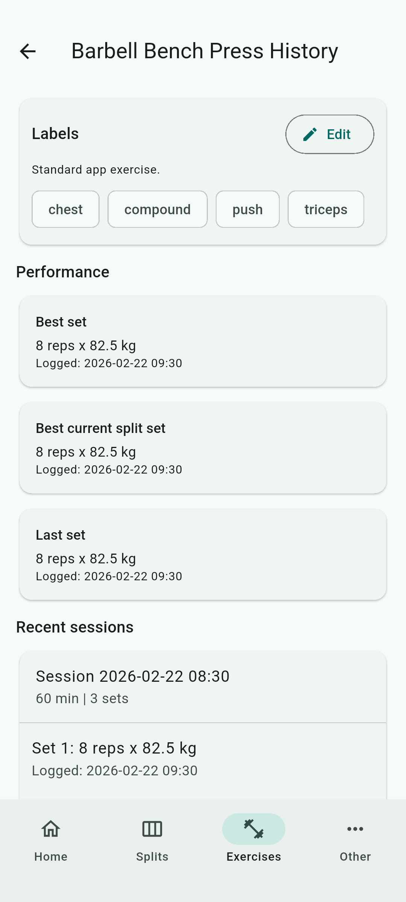 |
| 13 | `exercise_labels_editor` | Exercises - labels editor | `baseRealistic` | `exercises` | 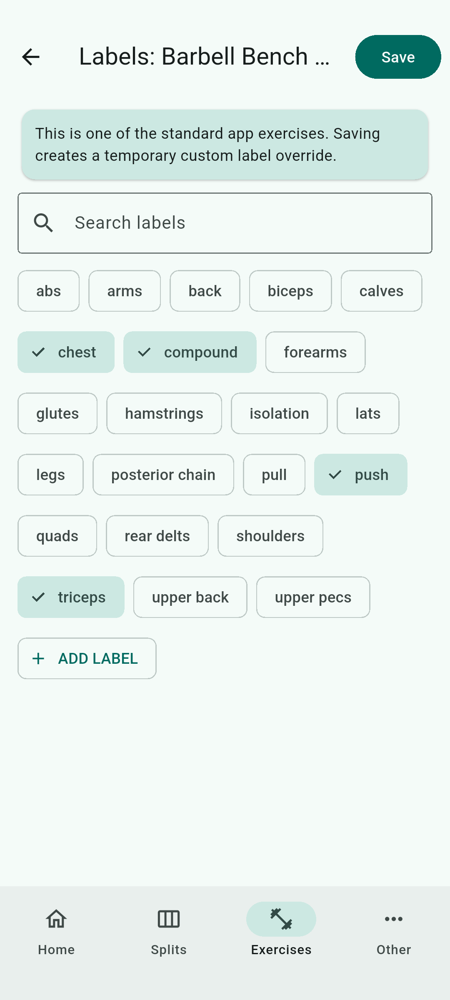 |
| 14 | `labels_catalog` | Other - labels catalog | `baseRealistic` | `other` |  |
| 15 | `logger_split_day_initial` | Logger - split day initial | `baseRealistic` | `logger` |  |
| 16 | `logger_split_day_with_inputs` | Logger - split day with inputs | `baseRealistic` | `logger` | 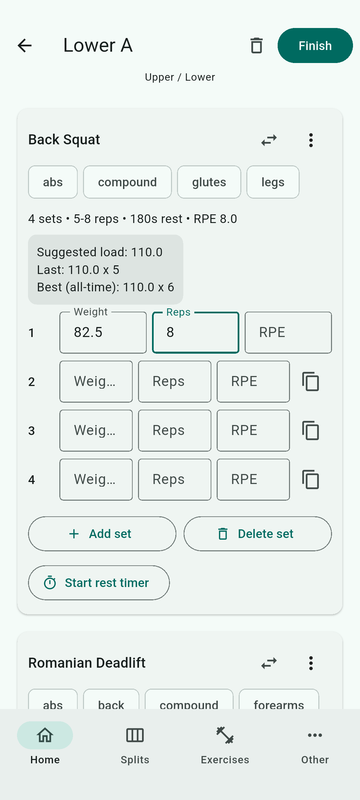 |
| 17 | `logger_free_empty` | Logger - free empty | `baseRealistic` | `logger` | 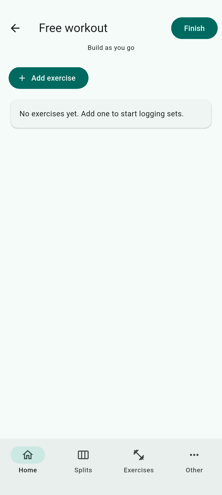 |
| 18 | `logger_free_with_exercises` | Logger - free with exercises | `baseRealistic` | `logger` | 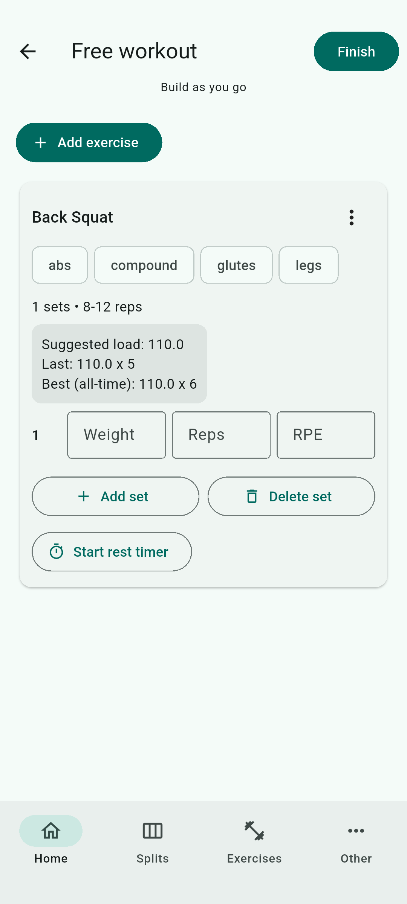 |
| 19 | `logger_finish_unfilled_warning` | Logger - finish with unfilled warning | `loggerSplitWithUnfilledRows` | `logger` | 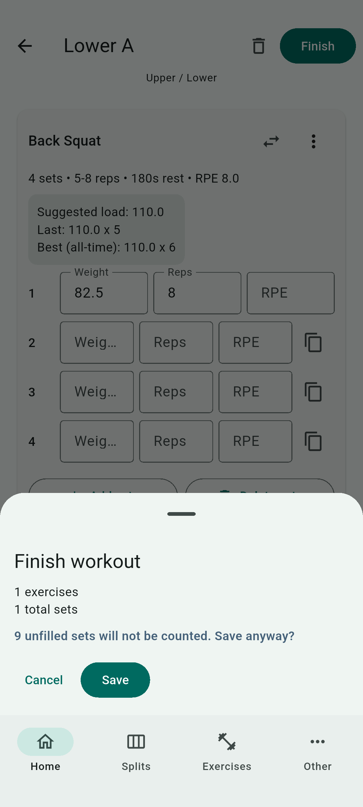 |
| 20 | `session_overview_editable` | Session overview editable | `baseRealistic` | `sessions` | 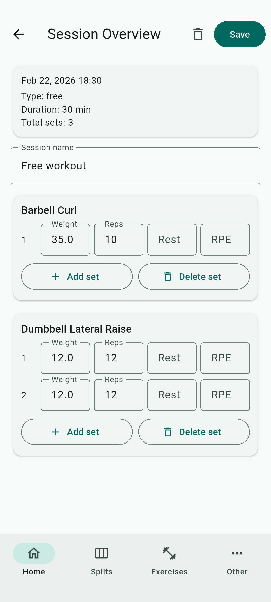 |
